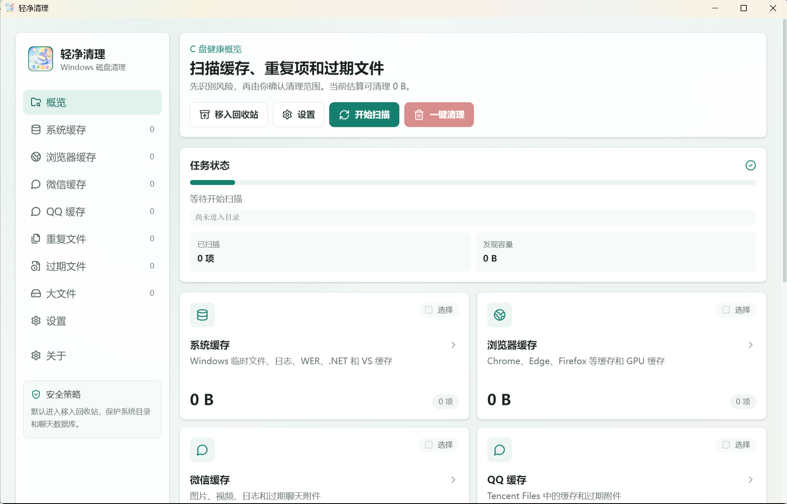

# Qingjing Cleaner

> A Windows disk cleaner built with Electron + Next.js.  
> 中文文档：[README.md](./README.md)



## Overview

Qingjing Cleaner is a desktop disk cleanup tool for Windows 10/11. It scans system caches, browser caches, chat app caches, duplicate files, expired files, and large files. Before cleanup, it shows detailed results and a confirmation summary to reduce the risk of accidental deletion.

Current version: `1.0.1`

## Features

- Windows system cache scanning and cleanup
- Browser cache scanning and cleanup
- WeChat and QQ cache scanning and cleanup
- Duplicate file detection in common C drive user folders
- Expired file and large file filtering
- Category cards with quick selection and detail views
- Cleanup confirmation summary
- Trash-first cleanup mode by default
- Auto update checks through GitHub Releases

## Safety

- Files are not permanently deleted by default
- Critical system directories are protected from scanning and deletion
- WeChat and QQ databases, account files, and configuration files are protected
- Risky expired file types are skipped, including shortcuts, configuration files, and static libraries
- Cleanup failures do not stop the whole task; failed items are recorded with reasons

## Download

Download the Windows installer from GitHub Releases:

[Download Qingjing Cleaner 1.0.1](https://github.com/AnsoNeko/cleaner/releases/tag/v1.0.1)

## Tech Stack

- Electron
- Next.js App Router
- TypeScript
- Tailwind CSS
- lucide-react
- electron-builder
- electron-updater

## Local Development

```powershell
npm install
npm run dev
```

## Type Check and Build

```powershell
npm run typecheck
npm run build
```

## Package for Windows

```powershell
npm run package
```

The installer is generated at:

```text
release/Cleaner-Setup-1.0.1.exe
```

## Usage Notes

- Review file details before cleanup and confirm that selected files are no longer needed.
- The default cleanup mode prefers the trash or quarantine instead of permanent deletion.
- Windows logs, Windows temporary directories, .NET temporary files, and similar system paths may require administrator privileges.
- Items that require administrator privileges are not selected automatically. Run the app as administrator if you need to clean them.
- WeChat and QQ databases, account files, and configuration files are protected from normal cache cleanup.

## License

This project is licensed under the [MIT License](./LICENSE).
