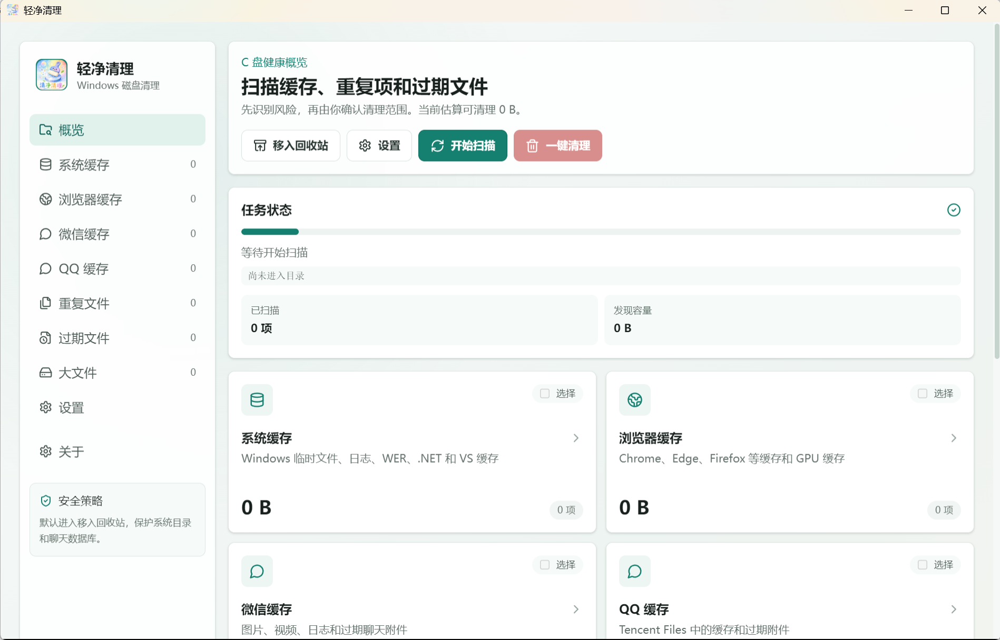

# Qingjing Cleaner

> A Windows disk cleaner built with Electron + Next.js.  
> 中文文档：[README.md](./README.md)



## Overview

Qingjing Cleaner is a desktop disk cleanup tool for Windows 10/11. It scans system caches, browser caches, chat app caches, duplicate files, expired files, and large files. Before cleanup, it shows detailed results and a confirmation summary to reduce the risk of accidental deletion.

Current version: `1.0.3`

## Changes in 1.0.3

- Discover legacy `WeChat Files`, current `xwechat_files`, redirected Windows Documents, and storage settings from both client generations. A manual WeChat storage path is available in Settings.
- Separate WeChat caches from old attachments, including media `.dat` files in legacy `FileStorage/MsgAttach` and current `msg/attach` layouts. Attachments require manual selection; databases, settings, and backups are protected.
- Add reviewed software caches for VS Code, Discord, Slack, Spotify, Zoom, classic Teams, npm, pip, and uv. Running applications are checked before cleanup.
- Identify suspected uninstall remnants using uninstall registry entries, Store packages, processes, and common executable markers. Only designated cache/log paths of supported desktop apps are included; absence of installation evidence is not proof of an uninstall. Results require manual selection and are checked again before cleanup.
- Review items are no longer selected automatically. Findings are deduplicated by path, incomplete scans report warnings, and cleanup verifies file timestamps, sizes, and path links.
- Stream directory entries without the previous 12,000-file cap. Quarantine and restore support verified transfers across volumes without overwriting existing targets. Serialize and atomically replace settings/scan storage; bound announcement requests and expire their caches.

See the [review report](docs/review-2026-10-08.md). Deep cleanup does not remove arbitrary AppData folders, registry keys, or Windows Installer caches.

## Features

- Windows system cache scanning and cleanup
- Admin-required system cleanup items shown as a separate category
- Browser cache scanning and cleanup
- WeChat and QQ cache scanning and cleanup
- Duplicate file detection in common C drive user folders
- Expired file and large file filtering
- Category cards with quick selection and detail views
- Cleanup confirmation summary
- Trash-first cleanup mode by default
- Auto update checks through GitHub Releases

## Safety

- Files are not permanently deleted by default
- Critical system directories are protected from scanning and deletion
- WeChat and QQ databases, account files, and configuration files are protected
- Risky expired file types are skipped, including shortcuts, configuration files, and static libraries
- Cleanup failures do not stop the whole task; failed items are recorded with reasons

## Download

Download the Windows installer from GitHub Releases:

[Download Qingjing Cleaner 1.0.3](https://github.com/AnsoNeko/cleaner/releases/tag/v1.0.3)

## Tech Stack

- Electron
- Next.js App Router
- TypeScript
- Tailwind CSS
- lucide-react
- electron-builder
- electron-updater

## Local Development

```powershell
npm install
npm run dev
```

## Type Check and Build

```powershell
npm run typecheck
npm run lint
npm test
npm run build
```

## Package for Windows

```powershell
npm run package
```

The installer is generated at:

```text
release/Cleaner-Setup-1.0.3.exe
```

## Usage Notes

- Review file details before cleanup and confirm that selected files are no longer needed.
- The default cleanup mode prefers the trash or quarantine instead of permanent deletion.
- Windows logs, Windows temporary directories, .NET temporary files, and similar system paths are grouped under the admin-required category.
- The admin-required category is not selected automatically. Run the app as administrator if you need to clean it.
- WeChat and QQ databases, account files, and configuration files are protected from normal cache cleanup.

## License

This project is licensed under the [MIT License](./LICENSE).
